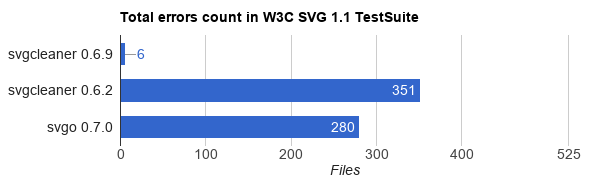
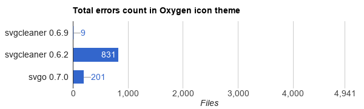
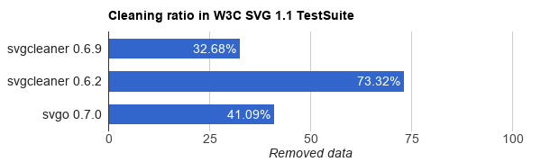
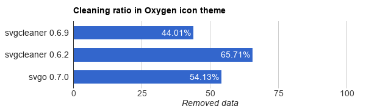
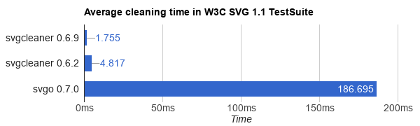
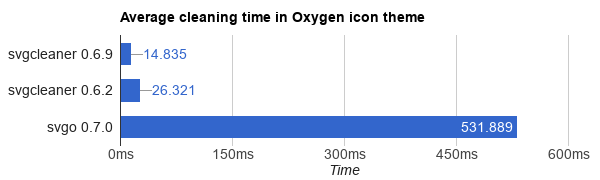

# svgcleaner

*svgcleaner* could help you to clean up your SVG files from the unnecessary data.

## Usage

### Dependencies

You need the latest stable Rust compiler.

*svgcleaner* is based on [libsvgdom](https://github.com/RazrFalcon/libsvgdom).

### Building

```bash
cargo build --release
```

### CLI

```
svgcleaner in.svg out.svg
```

Use `--help` for a list of the cleaning options. And a [doc](docs/svgcleaner.rst) for more details.

### GUI

GUI is still in an early alpha.

## Goals

1. **Correctness.** svgcleaner should not break an SVG file.
1. **Cleaning ratio.** More is better.
1. **Performance.** If something can be faster - it should be faster.
   An average SVG file should be processed by less than 16ms on a modern PC.

### Charts

There are only one alternative to svgcleaner - [svgo](https://github.com/svg/svgo),
so we will compare with it.

### Correctness

*Less is better.*



\* Yes, svgcleaner 0.6.2 is absolute garbage on this data set.



### Cleaning ratio

*More is better.*



\* And again, svgcleaner 0.6.2 is kinda superb, but since it breaks most
of the files - it's pointless.



### Performance

*Less is better.*





#### Notes

 - PC: i5-3570k@4.2GHz, Gentoo Linux Stable x86_64.

 - Input files are stored on HDD, cleaned files was saved to tmpfs.

 - I know that a performance comparison is not fair since `svgo` have to restart nodejs
each time. But I don't know how to prevent it or ignore nodejs starting time.

 - New `svgcleaner` was running using default options.

 - Old `svgcleaner` was running using default options with numeric `--*-precision=6`
   and `--create-viewbox` disabled.

 - `svgo` was running using default options with `--precision=6`.

 - Render error in tests above indicates that file has more then 2% of changed pixels.
   All images are rendered using QtWebKit in original resolution.

 - Used nodejs: `net-libs/nodejs-4.4.6(icu npm ssl -debug -snapshot -test
CPU_FLAGS_X86="sse2" PYTHON_TARGETS="python2_7")`.
   I tried the latest version, 6.4.0, but it even slower.

 - You can find links to the data sets [here](tools/files-testing/README.md).

 - You can repeat tests by yourself using [stats](tools/stats) app.

### Roadmap
V0.7
 - [x] Remove text related-attributes if there is no text.
 - [ ] Convert `width` and `height` attributes to `viewBox` attribute.
 - [ ] Ungroup groups.
 - [ ] Remove duplicated defs:
   - [ ] `feGaussianBlur`
   - [ ] `clipPath`
 - [ ] Remove invisible elements.
 - [ ] Convert units using specified DPI.
 - [ ] Group elements by the style attributes.
 - [ ] Remove `version` attribute.
 - [ ] Ungroup `switch` element.
 - [ ] Remove elements outside the viewbox.
 - [ ] Merge gradients.
 - [ ] Apply transforms to shapes:
   - [ ] paths
   - [ ] shapes
   - [ ] gradients
 - [ ] Replace equal elements by `use`:
   - [ ] `path`
   - [ ] `rect`
   - [ ] `circle`
   - [ ] `ellipse`
   - [ ] other...
 - [ ] Group text styles.
 - [ ] Process paths:
    - [ ] segments to relative
    - [ ] remove Z segments
    - [ ] remove unneeded MoveTo segments
    - [ ] remove tiny segments
    - [ ] convert segments to shorter one
    - [ ] join segments
 - [ ] Numbers comparing using custom precision.
 - [ ] Join font properties into the `font` attribute.
 - [ ] Join sequential paths.
 - [ ] Unix pipes.

Note, that current git version is pretty stable and ready to use.

### License

svgcleaner is licensed under the [GPL-2.0](https://www.gnu.org/licenses/old-licenses/gpl-2.0.en.html).
