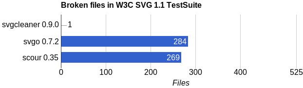
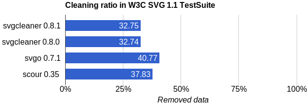
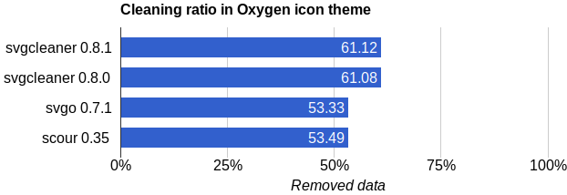
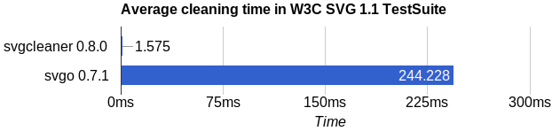
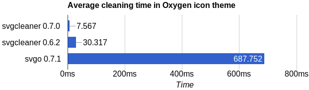

=========================
svgcleaner |build status|
=========================

.. |build status| image:: https://travis-ci.org/RazrFalcon/svgcleaner.svg?branch=master
   :target: https://travis-ci.org/RazrFalcon/svgcleaner

*svgcleaner* helps you clean up your SVG files, keeping them free from unnecessary data.

|

.. contents:: **Table of Contents**

Purpose
-------

The main purpose of *svgcleaner* is to losslessly reduce the size of an SVG image, created in a
vector editing application, before publishing.

Usually more than half of an SVG image's data is useless for rendering. For example:

- Temporary data used by the vector editing application
- Non-optimal SVG structure representation
- Unused and invisible graphical elements

... Are all unnecessary in a published SVG.

Goals
-----

#. **Correctness** - *svgcleaner* should not break an SVG file
#. **Cleaning ratio** - Higher is better
#. **Performance** - An average SVG file processing time should be closer to ~1ms on a modern PC

Alternatives
------------

- svgo_
- scour_

.. _svgo: https://github.com/svg/svgo
.. _scour: https://github.com/scour-project/scour

In addition to the main advantages of *svgcleaner* — like correctness, cleaning ratio and performance,
which are described below — there are some more nuances to be aware of:

#. *svgcleaner* cleans only one SVG file. It doesn't process SVGZ files.
   It doesn't process directories. It doesn't do anything else. Just one task*.
#. *svgcleaner* is strictly lossless by default. There are no destructive cleaning options enabled by default.
#. *svgcleaner* is portable. You can build it into a single executable without any external dependencies.

\* You can get all of these features using the `GUI <https://github.com/RazrFalcon/svgcleaner-gui>`_.

Charts
------

See `Testing notes <docs/testing_notes.rst>`_ for details.

All stats were collected using the latest release version.

Correctness
```````````

*Less is better.*



.. image:: docs/images/correctness_chart_oxygen.svg

Cleaning ratio
``````````````

*More is better.*



\* scour_ creates bigger files (-18.78%).



Cleaning time
`````````````

*Less is better.*





Other
`````

=========================  =================  ================  =========
Collection                 Size Before (MiB)  Size After (MiB)  Ratio (%)
=========================  =================  ================  =========
`Breeze icons theme`_      21.72              11.09             48.91
`Ardis icons theme`_       11.82              5.23              55.74
`Humanity icons theme`_    8.56               3.08              64.01
`Open Icon Library`_       207.45             69.44             66.53
`Elementary icons theme`_  17.72              7.09              59.95
`Adwaita icons theme`_     2.21               0.37              83.08
`Faience icon theme`_      22.35              11.14             50.16
`GCP Icons`_               0.344              0.082             75.9
=========================  =================  ================  =========

.. _`Breeze icons theme`: https://github.com/KDE/breeze-icons
.. _`Ardis icons theme`: https://github.com/Nitrux/ardis-icon-theme
.. _`Humanity icons theme`: https://wiki.ubuntu.com/Artwork/Incoming/Karmic/Humanity_Icons?action=AttachFile&do=view&target=humanity_2.1.tar.gz
.. _`Open Icon Library`: https://sourceforge.net/projects/openiconlibrary
.. _`Elementary icons theme`: https://github.com/elementary/icons
.. _`Adwaita icons theme`: https://github.com/GNOME/adwaita-icon-theme
.. _`Faience icon theme`: https://github.com/csharris/faience-icon-theme
.. _`GCP Icons`: https://cloud.google.com/icons/files/google-cloud-icons.zip

Documentation
-------------

Documentation can be found `here <docs/svgcleaner.adoc>`_.

Limitations
-----------

*svgcleaner* shouldn't change your file unless you tell it to, but there are still
things that can't be preserved. So even if you disable all cleaning options there are still things
that will be changed, such as:

- Original indent is not preserved
- All colors will be formatted as #RRGGBB and #RGB
- DOCTYPE, CDATA will be processed and removed
- CSS support is minimal
- CSS from the ``style`` element will be extracted and processes. The ``style`` element will be removed.
- The ``style`` attribute will be split into attributes
- The ``class`` attribute will be processed and removed
- Paths and transformations will be reformatted
- ``currentColor`` and ``inherit`` attributes values will be resolved
- Referenced elements will be moved to the ``defs`` element
- IRI and FuncIRI attributes that reference non-existing objects will be removed
- If the ``offset`` attribute value of the ``stop`` element is represented as percentage - it will be
  converted into a decimal number

Usage
-----

CLI
```

::

  svgcleaner in.svg out.svg


Change default options:

::

  svgcleaner --indent=2 --paths-coordinates-precision=5 --join-arcto-flags=yes in.svg out.svg

Use ``--help`` for a list of the cleaning options and see the
`documentation <docs/svgcleaner.adoc>`_ for more details.

GUI
```

You can get a GUI `here <https://github.com/RazrFalcon/svgcleaner-gui>`_.

Downloads
---------

You can get prebuilt packages `here <https://github.com/RazrFalcon/svgcleaner-gui/releases>`_.

Building
--------

Dependency: `Rust <https://www.rust-lang.org/>`_

::

  cargo build --release


If you're a Rust programmer, you can install *svgcleaner* using:

::

  cargo install svgcleaner

Contributing and Issues
-----------------------

See `CONTRIBUTING.md <CONTRIBUTING.md>`_ for details.

FAQ
---

See `FAQ.md <FAQ.md>`_ for details.

License
-------

*svgcleaner* is licensed under the `GPL-2.0 <https://www.gnu.org/licenses/old-licenses/gpl-2.0.en.html>`_.
