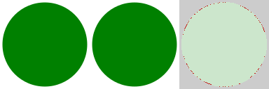

.. contents::

Rendering errors
================

The main goal of the *svgcleaner* - is correctness. Cleaned files must be rendered exactly
the same as original. If objects in your image changed their colors, shapes or positions - it's
definitely an error. But things are not that easy in the SVG world.

Anti-aliasing
-------------

By default, all shapes in the SVG is rendered with anti-aliasing. But it doesn't mean that all
of the rendering application uses same techniques.
So even slightest changes in numbers rounding can lead to errors like this:

\* original, cleaned, diff

*svgcleaner* does not treat such artifacts as errors.

Correctness according to the SVG spec
-------------------------------------

This is an even bigger problem since every rendering application supports their own SVG subset.
And even this subset can be implemented with errors. So cleaned image can became broken
only because rendering application will treat new data differently.

There are lots of examples (which is not categorized yet):

- These two paths are the same: ``M 10 -20 A 5.5 0.3 -4 1 1 0 -0.1``, ``M10-20A5.5.3-4 110-.1``.
  Sadly, most of the applications doesn't support such notation, even tough it's valid by SVG spec.
- ``clipPath`` element can contain only specific elements, but some applications renders all of them.
  So when *svgcleaner* removes invalid elements - the result image will be rendered differently,
  even tough it's correct by SVG spec.
- And so on...

And again - such artifacts is not an error.

A fixed file
------------

Some images, after cleaning, may render differently, but in a better way. It's because
modifications made them simpler to render. Such "differences" are not treated as errors.

A bigger file
-------------

If *svgcleaner* produce bigger file than original - it will print an error.
During testing, when such error occurs, we just copy an original file to the destination,
which makes test to pass.

Testing method
==============

Testing algorithm looks like this:

1. Clean image with cleaning application.
#. Render original image scaled to 512x512 (keeping an original aspect) using ``tools/svgrender`` [1]_.
#. Render cleaned image in the same way.
#. Compare images using imagemagick's ``compare``:

   ``compare -metric AE -fuzz 10% orig.png cleaned.png diff.png``
#. If AE value is bigger than 2% [2]_ of the image size - we have an error.

.. [1] ``svgrender`` is based on QtWebKit fork, which is the best way to render SVG from CLI.

.. [2] we use 2% threshold to filter anti-aliasing artifacts.

Notes
=====

- PC: i5-3570k 3.4GHz, Gentoo Linux x86_64.
- Input files are stored on HDD, cleaned files were saved to the ``tmpfs``.
- All tests are single-threaded.
- I know that a performance comparison is not fair since ``svgo`` have to restart ``node.js``
  each time. But I don't know how to prevent it or ignore ``node.js`` starting time.
- Cleaners options can be found [here](../tools/stats/src/main.rs).
- Used ``node.js``: ``9.2.1 (icu npm snapshot ssl -debug -doc -inspector -systemtap -test CPU_FLAGS_X86="sse2" PYTHON_TARGETS="python2_7")``.
- You can find links to the data sets `here <../tools/files-testing/README.md>`_.
- You can repeat tests by yourself using `stats <../tools/stats>`_ app.

Why Oxygen icons for testing?
-----------------------------

They not just plain/flat/simple icons, therefore they contain more complex structures.
So we have a higher probability of a cleaning error.
